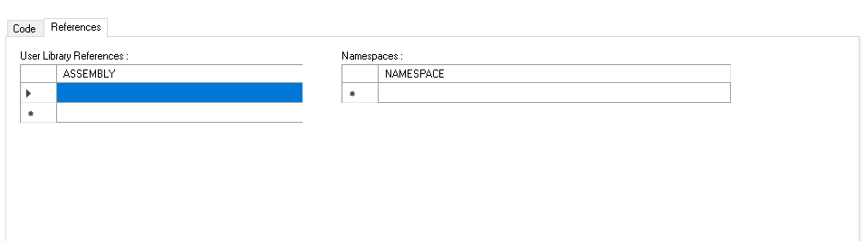
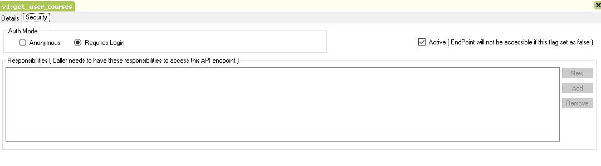

User REST Endpoints
==========================
User specific end points are similar to infrastructure end points, but differ in a way role based access control(RBAC) is enforced. The end points assume the user context and allow
operations that an user can perform based on his role and responsibilities. This helps to enforce data security and integrity while exposing the business logic via public REST end points.

## Supported mechanism
Bearer authentication is the only mechanism supported. It requires the user to acquire a token by supplying user credentials for login. Post successful login, a token is issued, which is used for further
API calls.

## Defining API's in Modeler
BizAPP Modeler allows you to define API's using the industry standard best practices and strategies. API's are defined at an application level and thus helps to logically group function specific 
API's and enforce access control on top of it.

It is mandatory to set the route template at the application level. The following snapshot shows one such example of setting the base route template URI for all API's defined under an application.

### API Versioning
One of the major challenges around exposing services is handling updates to the API contracts. Clients may not want to update their application when the API changes, hence a versioning
strategy is crucial. Versioning strategy allows clients to continue to use the existing API and migrate their applications to newer API when they are ready.

#### Versioning through URI Path
This is one of the most commonly used mechanism to version API's. BizAPP Modeler implicitly enforces this mechanism to ensure that URI includes a versioning strategy.
Internal version of the API can use 1.2.3 format, so it looks like as follows.

* **Major Version** : The version used in the URI and denotes a breaking changes to the API. Internally a new major version implies creating a new API and version number is used 
to route to the correct version of the API.

* **Minor and Patch versions** : These are transparent to the client and used internally for backward-compatible updates. They are usually communicated in change logs to 
inform clients about a new functionality or a bug fix. Minor and Patch version is optional can be managed with only Major version alone.

This solution often uses URI routing to point to a specific version of the API. Cache keys are controlled by the URI and any change in the URI path with a different version invalidates
the cache keys. This also enables clients to cache URI resources without worrying about the impact of newer version of API's.

#### Adding a new endpoint version
To add a new endpoint version in BizAPP Modeler, navigate to an application and perform the below steps.
* Right click on APIs node and click on **Add EndpointVersion**.
* Enter the name in the popup window. If you want to name the versions using different naming strategy, input the same, Otherwise keep the version names same as real versions. For e.g. v1.

* Click OK to create a new version.
* A new window appears on the right side with a new version information.
* Enter **API Route Template** value in the text box. This is mandatory to indicate the version in URI Path.

### API Endpoints

New API endpoints can be created under a specific version. To create an endpoint, right click on the API version and add New APIEndPoint.
Below image shows a sample endpoint created.

* **API Route Template** is mandatory to set the route for this API.Route needs to be unique across all APIs defined under a version.
* Supported **HttpMethod** verbs are GET,POST,PUT and DELETE.
* Supported **Handler Types** are QueryResult, Method and Method Snippet.

Every endpoint defined in the modeler is transformed into equivalent executable code on the fly, thus eliminating the need for compilation and deployment complexities. It applies to 
all **HandlerType** modes supported.

#### API using query result

In most of the cases, an API is created to expose information from the queries executed internally. The results from the query is concise and can be exposed as is to the end users without going through any data obfuscation. In such cases, BizAPP Modeler makes it easy for developers to expose the queries that are already defined in the solution.

To create a new Endpoint using a query,
* Create a new API Endpoint.
* Select **handlerType** as Query.
* Select a query by clicking on ... button.

#### API using code (Method and MethodSnippet)

For advanced developers that want to make use of ASP.NET Core features to define methods and decorate them, both **Method** and **MethodSnippet** provide an opportunity to control 
request and response parameters. 

As the name suggests **Method** includes a complete signature of the method that would be exposed as an Endpoint. **MethodSnippet** only has the body of the code excluding the method definition.

**Anatomy of an API Method**

- **Web API Conventions for API Documentation**

[Swagger](https://swagger.io) is an Interface Description Language for describing RESTful API expressed using JSON. Any API methods defined in BizAPP Modeler is automatically wrapped inside controller actions and decorated with attributes required.

To enable documentation on the actions, ProducesResponseType Attribute is typically used to indicate the response types supported by the method actions. This serves as a documentation to depict the request and response types supported by the method actions.

For more information, refer to [Web API Conventions](https://docs.microsoft.com/en-us/aspnet/core/web-api/advanced/conventions?view=aspnetcore-5.0)

- **Signature**

  Return type :- 
	* *ActionResult* or *ActionResult&lt;T&gt;* for synchrounous actions.
	* *Task&lt;ActionResult&gt;* or *Task&lt;ActionResult&lt;T&gt;&gt;* for asynchrounous actions.
    For more information, refer to [Action Return Types](https://docs.microsoft.com/en-us/aspnet/core/web-api/action-return-types?view=aspnetcore-5.0)
	
  In parameters :-
	* Service Bindings - *[FromServices]* attribute is used to decorate BizAPP specific services required for execution.
	    * *IParameterCacheWrapperService* - Provides access to rule and parameter values.
		* *IQueryExecutionService* - Provides API's to execute BizAPP QueryObject and BSQL queries for DQL and DML statements.
		* *ISessionServiceWrapperService* - Provides API's to give access to underlying ISessionService API interface.
	
	* Model Bindings - Below attributes are used to bind to the incoming request.
		* *[FromQuery]* - Gets values from the query string.
		* *[FromBody]* - Gets values from the request body.
		* *[FromHeader]* - Gets values from HTTP headers.
		* *[FromForm]* - Gets values from posted form fields.
		* *[FromRoute]* - Gets values from route data.
	  For more information, refer to [Model Binding in ASP.NET Core](https://docs.microsoft.com/en-us/aspnet/core/mvc/models/model-binding?view=aspnetcore-5.0)
	
	* Model Validation - Below attributes are supported at parameter or field or property levels.
		* *[Required]* - Validates that the field is not null. Swagger also uses this attribute to indicate the fields that are mandatory in the request payload.
		* *[CreditCard]* - Validates that the property has a credit card format. Requires jQuery Validation Additional Methods.
		* *[Compare]* - Validates that two properties in a model match.
		* *[EmailAddress]* - Validates that the property has an email format.
		* *[Phone]* - Validates that the property has a telephone number format.
		* *[Range]* - Validates that the property value falls within a specified range.
		* *[RegularExpression]* - Validates that the property value matches a specified regular expression.
		* *[StringLength]* - Validates that a string property value doesn't exceed a specified length limit.
		* *[Url]* - Validates that the property has a URL format.
		* *[Remote]* - Validates input on the client by calling an action method on the server.
	  The built-in attributes can be used for model validations also. For more information, refer to [System.ComponentModel.DataAnnotations](https://docs.microsoft.com/en-us/aspnet/core/mvc/models/validation?view=aspnetcore-5.0)
	
- **Method Body**
  * *Logger* is the property auto injected to the controller. This can be used to write logs and debug execution issues in the code.
  * Other properties and methods from [ControllerBase](https://docs.microsoft.com/en-us/dotnet/api/microsoft.aspnetcore.mvc.controllerbase?view=aspnetcore-5.0) base class is supported.
  
- **References**

  Your code may need additional libraries to implement the business logic. You can include additional assemblies by adding the names under *User Library References*. 
  Any namespaces can be added under *NameSpaces*.
  
  

-  **Security**

   Any API created may have to be secured from unauthorized access. BizAPP supports the following to secure APIs from being accessed by unauthorized users.
   
	* *Authentication* - Enforces the identity of the user. BizAPP uses/supports Bearer authentication for all API calls.
	* *Authorization* - Helps to decide whether an user is allowed to perform an action. BizAPP allows authorization using its built-in roles and responsibility models (RBAC).
	* Modes supported for authorization.
	  * Anonymous - Allows open access to API for all users as if it were public.
	  * Requires Login - Uses Bearer Authentication token to enforce access.
	  * Responsibility - In addition to *Bearer token*, further access control can be defined using responsibilities. This restricts access to the actions an user can perform.
  
  
	
- **Disabling an API**	

  By default, all APIs defined in the modeler are marked active. If you want this endpoint to be inaccessible, then it can be marked inactive. This will force the runtime to reload
  endpoints and will not be part of the routes.